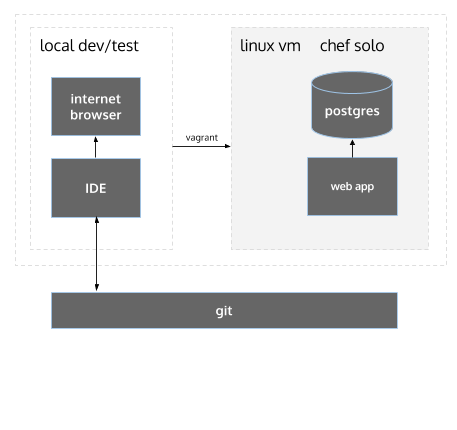

Create a local self contained environment for app deployment.

Includes Ruby, Rails, Nginx/Passenger, Java, PostgreSQL, Node.js, npm, bower, elasticsearch.



## 1. Installation reqs

* VirtualBox (tested w/ 4.3.12)
* Vagrant (tested w/ 1.6.3)
* Ruby (tested w/ 2.1.2)

## 2. Get going

Install vagrant omnibus plugin so we can specify version of chef solo in our vagrantfile

```
vagrant plugin install vagrant-omnibus
```

Clone the repo

```
git clone git@github.com:excellaco/my-dev-box.git
```

Update the host's local project path to share with the vm, e.g. a web app you're developing locally on the host machine. Creates `vagrant.yml` file and
creates the `Vagrantfile` from `Vagrantfile.example`.

```ruby
ruby config_vagrant.rb -l /changeme-absolute-path-to-proj-dir
```

Stand it up

```
vagrant up
```

Creates a new Linux VM, currently Ubuntu 14.04 w/ 4GB RAM, then installs the cookbooks with Chef.

NOTE: if you are on a Mac and receive an error that looks like: "clang: error: unknown argument: '-multiply_definedsuppress' [-Wunused-command-line-argument-hard-error-in-future]", you may need to run the "gem install berkshelf -v 3.1.4" command as: "sudo ARCHFLAGS=-Wno-error=unused-command-line-argument-hard-error-in-future gem install berkshelf -v 3.1.4"

## 3. Verify

```
vagrant ssh
ruby -v
rails -v
java -version
...
```

## 4. Vagrant Commands

To restart the VM and re-provision

```
vagrant reload --provision
```

Clean shutdown

```
vagrant halt
```

Remove the VM completely

```
vagrant destroy
```

Start again

```
vagrant up
```

## 5. Additional configuration (optional)

Existing settings in your vagrant.yml file will be persisted. Only specifie change will occur. You will need to restart your vagrant box for changes to take effect.

Change number of cpus assigned to your VM (default is 1)

```
ruby config_vagrant.rb -c <# of cpus>
```

Change amount of memory assigned to your VM (default is 4096)

```
ruby config_vagrant.rb -m <amount of memory (MB)>
```

Change local project path that you initially set up in step #2

```
ruby config_vagrant.rb -l <absolute-path>
```

Change guestpath on your VM (default is /vagrant_data)

```
ruby config_vagrant.rb -g <absolute-path>
```
